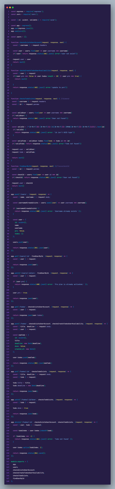
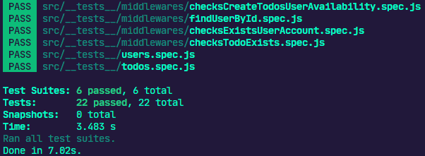

# Desafio 2 do Ignite Trilha NodeJS


<h3 align="center">
  Desafio 02: Trabalhando Com Middlewares
</h3>

<p align="center">
  

  <a href="https://app.rocketseat.com.br/me/matheus-marins">
    
  </a>

 <a href="https://github.com/rocketseat-education/ignite-template-trabalhando-com-middlewares/stargazers">
    
  </a>
</p>

---

# :rocket: Sobre o desafio

Nesse desafio você trabalhei mais a fundo com middlewares no Express.

Para facilitar um pouco mais do conhecimento da regra de negócio, você irá trabalhei com a mesma aplicação do desafio anterior: **[Desafio 1 - Conceitos do Node.js](https://github.com/Mar0la/ignite-conceitos-nodejs)**

- Criar um novo *todo*;
- Listar todos os *todos*;
- Alterar o `title` e `deadline` de um *todo* existente;
- Marcar um *todo* como feito;
- Excluir um *todo*;

Tudo isso para cada usuário em específico. Além disso, dessa vez teremos um plano grátis onde o usuário só pode criar até dez todos e um plano Pro que irá permitir criar todos ilimitados, isso tudo usando middlewares para fazer as validações necessárias.

### **Para saber tudo sobre o desafio acesse [NotionDesafio](https://www.notion.so/Desafio-02-Trabalhando-com-middlewares-4f89bf538c2e4ee291382b92bdc36790).**
 
---
### :keyboard: Instalação e Execução do Projeto

- Clone este repositório

```
> git clone https://github.com/Mar0la/ignite-tralhando-com-middlewares
```

- Navegue até o diretório principal do projeto

```
> cd ignite-trabalhando-com-middlewares
```

- Instale as dependências com o Yarn

```
yarn
```

- Rode a suite de testes

```
yarn test
```

- Execute o projeto

```
yarn dev
```
---
### **Resolução do Desafio**
  


### **Retorno que devemos ter ao digitar  <code>yarn test</code>** no terminal
  

---
## FeedBack do Desafio
  - Um projeto bem  interessante sobre como ultilizar middlewares, a forma de como se passa o middleware nas rotas foi algo surpreendente para min, pois se tivesse que fazer uma função em cada rota o código ficaria bem extenso.
---


